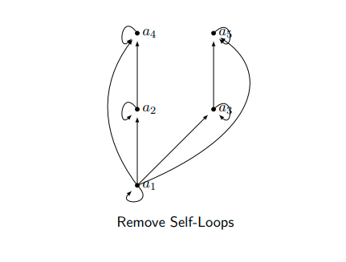
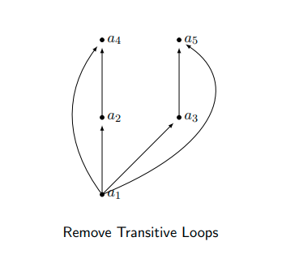
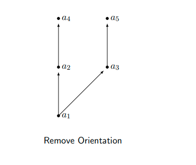
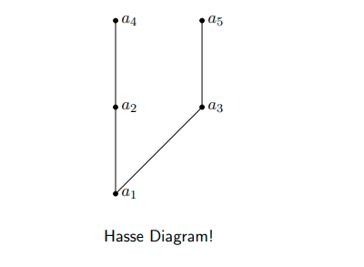
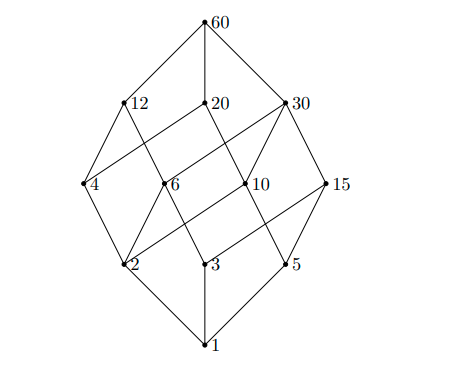

Consider the recent renovation of  Hall. In this process several things had to be done.

- Remove Asbestos
- Replace Windows
- Paint Walls
- Refinish Floors
- Assign Offices
- Move in Office-Furniture.

Clearly, some things had to be done before others could even begin Asbestos had to be removed before anything; painting had to be done before the floors to avoid ruining them, etc. On the other hand, several things could have been done concurrently—painting could be done while replacing the windows and assigning office could have been done at anytime. Such a scenario can be nicely modeled using partial orderings.

### Partial Order Definition

A relation $R$ on a set $S$ is called a partial order if it is reflexive, antisymmetric and transitive. A set $S$ together with a partial ordering $R$ is called a partially ordered set or poset for short and is denoted by $(S, R)$

Partial orderings are used to give an order to sets that may not have a natural one. In our renovation example, we could define an ordering such that $(a, b) \in R$ if a must be done before $b$ can be done.
We use the notation

$a \preccurlyeq b$ to indicate that $(a, b) \in R$ is a partial order and
$a \prec b$ when $a \neq b$.

### Comparability Definition
The elements a and b of a poset $(S, \C)$ are called comparable if either a $\preccurlyeq$ b or b $\preccurlyeq$ a. When $a, b \in S$ such that neither are comparable, we say that they are incomparable. Looking back at our renovation example, we can see that

Remove Asbestos $\prec a_{i}$ for all activities $a_{i}$. Also, 
Paint Walls $\prec$  Refinish Floors 
Some items are also incomparable—replacing windows can be done before, after or during the assignment of offices.

### Total Orders Definition

If $(S, \preccurlyeq )$ is a poset and every two elements of S are comparable, S is called a totally ordered set. The relation $\preccurlyeq$ is said to be a total order.

 ##### Example

The set of integers over the relation “less than equal to” is a total order; $(Z, \preccurlyeq)$ since for every $a, b \in Z$, it must be the case that
$ a \preccurlyeq b or b \preccurlyeq a $.

What happens if we replace $\preccurlyeq$ with $\prec$

### Hasse Diagram

As with relations and functions, there is a convenient graphical representation for partial orders—Hasse Diagrams. Consider the digraph representation of a partial order—since we know we are dealing with a partial order, we implicitly know that the relation must be reflexive and transitive. Thus we can simplify the graph as follows:

- Remove all self-loops.
- Remove all transitive edges.
- Make the graph direction-less—that is, we can assume that the orientations are upwards.

The resulting diagram is far simpler.

 

Of course, you need not always start with the complete relation in the partial order and then trim everything. Rather, you can build a Hasse directly from the partial order

Draw a Hasse diagram for the partial ordering {(a, b) | a | b} on {1, 2, 3, 4, 5, 6, 10, 12, 15, 20, 30, 60} (these are the divisors of 60)

### Extremal Elements
We will define the following terms:
- A maximal/minimal element in a poset $(S, \preccurlyeq)$.
- The maximum (greatest)/minimum (least) element of a poset $(S, \preccurlyeq)$.
- An upper/lower bound element of a subset $A$ of a poset $(S, \preccurlyeq)$.
- The greatest upper/least lower bound element of a subset $A$ of a poset $(S, \preccurlyeq)$.
Lattice

#### Maximal Element Definition
An element a in a poset $(S, \prec)$ is called maximal if it is not lessthan any other element in $S$. That is, $\exists b \in S(a \prec b)$
If there is one unique maximal element a, we call it the maximum element (or the greatest element)

#### Minimal Element Definition
An element a in a poset $(S, \preccurlyeq)$ is called minimal if it is not greater than any other element in $S$. That is,$\exists b \in S(b \prec a)$
If there is one unique minimal element a, we call it the minimum element (or the least element).