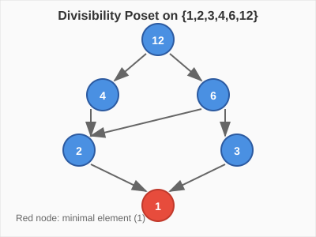
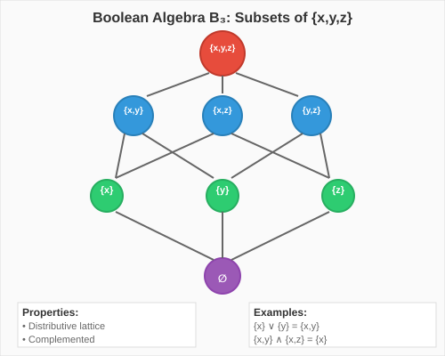
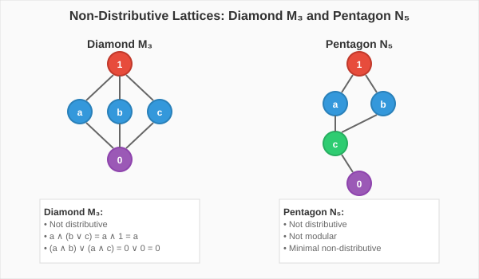
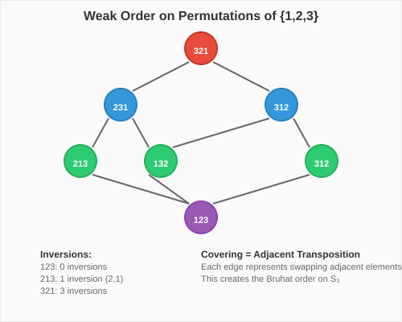
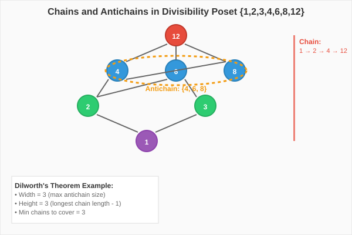
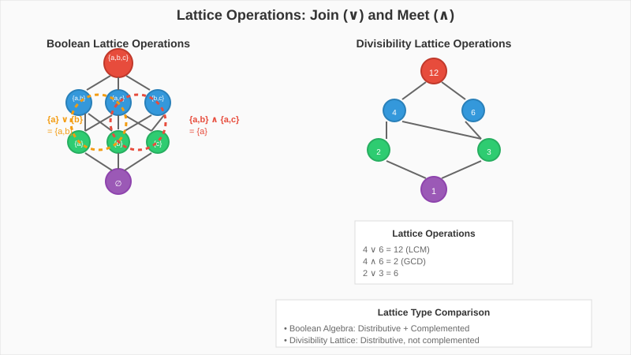
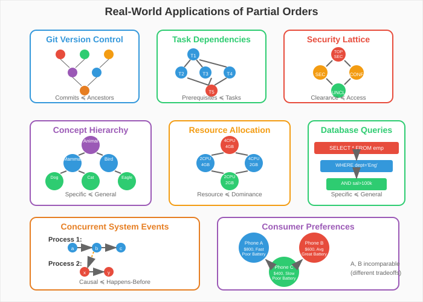

### 1. Introduction to Relations

Before diving into partial orders, let's establish the foundational concept of relations and their properties.

### Definition: Binary Relation
A **binary relation** $ R $ on a set $ A $ is a subset of $ A \times A $. We write $ aRb $ (or $ a \sim b $) to mean $ (a,b) \in R $.

#### Key Properties of Relations

**Reflexivity**: A relation $ R $ on set $ A $ is reflexive if for every element $ a \in A $, we have $ aRa $.
- Example: " $ = $ " on real numbers (every number equals itself)
- Counter-example: " $ < $ " on real numbers (no number is less than itself)

**Antisymmetry**: A relation $ R $ on set $ A $ is antisymmetric if for all $ a, b \in A $, if $ aRb $ and $ bRa $, then $ a = b $.
- Example: " $ \leq $ " on real numbers (if $ a \leq b $ and $ b \leq a $, then $ a = b $)
- Counter-example: "loves" relation among people (mutual love doesn't imply identity)

**Transitivity**: A relation $ R $ on set $ A $ is transitive if for all $ a, b, c \in A $, if $ aRb $ and $ bRc $, then $ aRc $.
- Example: "ancestor of" relation (if $ A $ is ancestor of $ B $ and $ B $ is ancestor of $ C $, then $ A $ is ancestor of $ C $)
- Counter-example: "is friend of" relation (friend of friend isn't necessarily a friend)

**Symmetry**: A relation $ R $ on set $ A $ is symmetric if for all $ a, b \in A $, if $ aRb $ then $ bRa $.
- Example: "is married to" relation
- Counter-example: "is parent of" relation

### 2. Partial Orders: Definition and Properties

#### Definition: Partial Order (Poset)
A **partial order** (or **partially ordered set**, abbreviated as **poset**) is a set $ P $ together with a binary relation $ \preceq $ that satisfies three properties:

1. **Reflexivity**: For all $ a \in P $, $ a \preceq a $
2. **Antisymmetry**: For all $ a, b \in P $, if $ a \preceq b $ and $ b \preceq a $, then $ a = b $
3. **Transitivity**: For all $ a, b, c \in P $, if $ a \preceq b $ and $ b \preceq c $, then $ a \preceq c $

We denote a partially ordered set as $ (P, \preceq) $ or simply $ P $ when the relation is clear from context.

### Strict Partial Order
The **strict partial order** associated with $ \preceq $ is the relation $ \prec $ defined by:
$ a \prec b $ if and only if $ a \preceq b $ and $ a \neq b $

This relation is:
- **Irreflexive**: No element is related to itself
- **Asymmetric**: If $ a \prec b $, then not $ b \prec a $
- **Transitive**: If $ a \prec b $ and $ b \prec c $, then $ a \prec c $

#### Comparability
Two elements $ a $ and $ b $ in a poset are **comparable** if either $ a \preceq b $ or $ b \preceq a $ (or both, in which case $ a = b $).
Elements that are not comparable are called **incomparable**.

### 3. Examples of Partial Orders

#### Example 1: Divisibility on Natural Numbers
Let $ N = \{1, 2, 3, 4, 5, 6, 7, 8, 9, 10, 11, 12\} $ and define $ a \preceq b $ if $ a $ divides $ b $.

**Verification**:
- Reflexivity: Every number divides itself ✓
- Antisymmetry: If $ a|b $ and $ b|a $, then $ a = b $ ✓
- Transitivity: If $ a|b $ and $ b|c $, then $ a|c $ ✓

**Relations**: 
- $ 1 \preceq $ everything (1 divides all numbers)
- $ 2 \preceq 4, 6, 8, 10, 12 $
- $ 3 \preceq 6, 9, 12 $
- $ 4 \preceq 8, 12 $
- $ 6 \preceq 12 $

**Incomparable pairs**: $ (2,3) $, $ (2,5) $, $ (3,4) $, $ (3,5) $, $ (4,5) $, $ (4,6) $, $ (4,9) $, etc.

#### Example 2: Subset Relation on Power Set
Let $ A = \{a, b, c\} $ and consider $ \mathcal{P}(A) = \{\emptyset, \{a\}, \{b\}, \{c\}, \{a,b\}, \{a,c\}, \{b,c\}, \{a,b,c\}\} $ with the subset relation $ \subseteq $.

**Structure**:
- $ \emptyset \subseteq $ all sets
- $ \{a\} \subseteq \{a,b\}, \{a,c\}, \{a,b,c\} $
- $ \{b\} \subseteq \{a,b\}, \{b,c\}, \{a,b,c\} $
- $ \{c\} \subseteq \{a,c\}, \{b,c\}, \{a,b,c\} $
- $ \{a,b\}, \{a,c\}, \{b,c\} \subseteq \{a,b,c\} $

**Incomparable pairs**: $ (\{a\}, \{b\}) $, $ (\{a\}, \{c\}) $, $ (\{b\}, \{c\}) $, $ (\{a,b\}, \{a,c\}) $, $ (\{a,b\}, \{b,c\}) $, $ (\{a,c\}, \{b,c\}) $

#### Example 3: Lexicographic Order on Strings
Consider the set of strings $ \{a, aa, ab, b, ba, bb\} $ with lexicographic ordering (dictionary order).

**Order**: $ a \preceq aa \preceq ab \preceq b \preceq ba \preceq bb $

This is actually a **total order** since every pair of elements is comparable.

#### Example 4: Information Order on Partial Functions
Let $ X = \{1, 2, 3\} $ and $ Y = \{a, b\} $. Consider partial functions from $ X $ to $ Y $, ordered by information content: $ f \preceq g $ if $ \text{dom}(f) \subseteq \text{dom}(g) $ and $ f(x) = g(x) $ for all $ x \in \text{dom}(f) $.

**Example functions**:
- $ f_1 $: undefined everywhere
- $ f_2 $: $ 1 \mapsto a $
- $ f_3 $: $ 2 \mapsto b $
- $ f_4 $: $ 1 \mapsto a, 2 \mapsto b $
- $ f_5 $: $ 1 \mapsto a, 3 \mapsto a $

**Relations**: $ f_1 \preceq $ everything, $ f_2 \preceq f_4 $, $ f_2 \preceq f_5 $, $ f_3 \preceq f_4 $, but $ f_2 $ and $ f_3 $ are incomparable.

### 4. Special Elements in Partial Orders

### Minimal and Maximal Elements
- An element $ a $ is **minimal** if there is no element $ b $ such that $ b \prec a $
- An element $ a $ is **maximal** if there is no element $ b $ such that $ a \prec b $

**Note**: A poset may have multiple minimal/maximal elements, or none at all.

### Least and Greatest Elements
- An element $ a $ is the **least element** (or **minimum**) if $ a \preceq b $ for all $ b $ in the poset
- An element $ a $ is the **greatest element** (or **maximum**) if $ b \preceq a $ for all $ b $ in the poset

**Note**: If they exist, least and greatest elements are unique.

#### Lower and Upper Bounds
For a subset $ S $ of a poset $ P $:
- An element $ a \in P $ is a **lower bound** of $ S $ if $ a \preceq s $ for all $ s \in S $
- An element $ a \in P $ is an **upper bound** of $ S $ if $ s \preceq a $ for all $ s \in S $

#### Infimum and Supremum
For a subset $ S $ of a poset $ P $:
- The **infimum** (or **greatest lower bound**, **glb**) of $ S $ is the greatest element among all lower bounds of $ S $
- The **supremum** (or **least upper bound**, **lub**) of $ S $ is the least element among all upper bounds of $ S $

**Example**: In the divisibility poset on $ \{1,2,3,4,5,6,12\} $:
- $ \inf(\{4,6\}) = 2 $ (greatest common divisor)
- $ \sup(\{4,6\}) = 12 $ (least common multiple)

### 5. Hasse Diagrams: Construction and Interpretation

#### Definition and Purpose
A **Hasse diagram** is a graphical representation of a finite partially ordered set that eliminates redundant information by showing only the "covering" relations.

#### Covering Relation
Element $ a $ **covers** element $ b $ (written $ b \lessdot a $) if:
1. $ b \prec a $ ($ b $ is strictly less than $ a $)
2. There is no element $ c $ such that $ b \prec c \prec a $

#### Construction Rules for Hasse Diagrams

1. **Vertices**: Each element of the poset is represented by a vertex
2. **Edges**: Draw an edge between $ a $ and $ b $ if one covers the other
3. **Vertical arrangement**: If $ a \prec b $, place $ a $ below $ b $
4. **Transitivity elimination**: Don't draw edges for relations that follow from transitivity
5. **No self-loops**: Reflexivity is implicit
6. **Direction**: Lower elements are "less than" higher elements

#### Step-by-Step Construction Example

**Poset**: Divisibility on $ \{1, 2, 3, 4, 6, 12\} $

**Step 1**: List all relations
- $ 1|1, 1|2, 1|3, 1|4, 1|6, 1|12 $
- $ 2|2, 2|4, 2|6, 2|12 $
- $ 3|3, 3|6, 3|12 $
- $ 4|4, 4|12 $
- $ 6|6, 6|12 $
- $ 12|12 $

**Step 2**: Identify covering relations
- $ 1 \lessdot 2 $ ($ 1 < 2 $, no element between)
- $ 1 \lessdot 3 $ ($ 1 < 3 $, no element between)
- $ 2 \lessdot 4 $ ($ 2 < 4 $, no element between)
- $ 2 \lessdot 6 $ ($ 2 < 6 $, no element between)
- $ 3 \lessdot 6 $ ($ 3 < 6 $, no element between)
- $ 4 \lessdot 12 $ ($ 4 < 12 $, no element between)
- $ 6 \lessdot 12 $ ($ 6 < 12 $, no element between)

**Step 3**: Draw the diagram



#### Reading Hasse Diagrams

**To determine if $ a \preceq b $**: Check if there's an upward path from $ a $ to $ b $.

**Examples using the divisibility diagram above**:
- $ 1 \preceq 12 $? Yes (path: $ 1 \to 2 \to 4 \to 12 $ or $ 1 \to 3 \to 6 \to 12 $)
- $ 2 \preceq 6 $? Yes (direct path: $ 2 \to 6 $)
- $ 4 \preceq 6 $? No (no upward path from 4 to 6)

### 6. Advanced Examples and Applications

#### Example 1: Boolean Algebra B₃
Consider the Boolean algebra of subsets of a 3-element set $ \{x, y, z\} $.

**Elements**: All 8 subsets of $ \{x, y, z\} $
**Relation**: Subset inclusion $ \subseteq $



**Properties**:
- Least element: $ \emptyset $
- Greatest element: $ \{x,y,z\} $
- Every pair has a unique inf and sup
- Complemented (every element has a complement)

**Operations**:
- Join ($ \vee $): $ \{x\} \vee \{y\} = \{x,y\} $
- Meet ($ \wedge $): $ \{x,y\} \wedge \{x,z\} = \{x\} $
- Complement: $ \overline{\{x\}} = \{y,z\} $

#### Example 2: Non-Distributive Lattices



The **Diamond lattice $ M_3 $** and **Pentagon lattice $ N_5 $** are fundamental examples of non-distributive lattices. These are the smallest lattices that fail the distributive property.

**Diamond $ M_3 $ failure**:
$ a \wedge (b \vee c) = a \wedge 1 = a $
$ (a \wedge b) \vee (a \wedge c) = 0 \vee 0 = 0 $
Since $ a \neq 0 $, distributivity fails.

**Pentagon $ N_5 $ failure**:
Similarly demonstrates non-distributivity and is also non-modular.

#### Example 3: Partition Lattice
Consider all partitions of the set $ \{1, 2, 3, 4\} $ ordered by refinement.

**Partitions**:
- $ \{\{1,2,3,4\}\} $ (coarsest)
- $ \{\{1,2,3\}, \{4\}\} $, $ \{\{1,2,4\}, \{3\}\} $, $ \{\{1,3,4\}, \{2\}\} $, $ \{\{2,3,4\}, \{1\}\} $
- $ \{\{1,2\}, \{3,4\}\} $, $ \{\{1,3\}, \{2,4\}\} $, $ \{\{1,4\}, \{2,3\}\} $, $ \{\{1,2\}, \{3\}, \{4\}\} $, $ \{\{1,3\}, \{2\}, \{4\}\} $, $ \{\{1,4\}, \{2\}, \{3\}\} $, $ \{\{2,3\}, \{1\}, \{4\}\} $, $ \{\{2,4\}, \{1\}, \{3\}\} $, $ \{\{3,4\}, \{1\}, \{2\}\} $
- $ \{\{1\}, \{2\}, \{3\}, \{4\}\} $ (finest)

**Refinement relation**: $ P_1 \preceq P_2 $ if every block of $ P_1 $ is contained in some block of $ P_2 $.

#### Example 4: Young Diagrams
Young diagrams (used in representation theory) form a partial order under inclusion.

**Example Young diagrams for partitions of 4**:

$ \begin{array}{cccc}
\square\square\square\square & \square\square\square & \square\square & \square \\
& \square & \square\square & \square \\
& & & \square \\
& & & \square
\end{array} $

**Ordering**: $ \lambda \preceq \mu $ if the Young diagram of $ \lambda $ fits inside the Young diagram of $ \mu $.

#### Example 5: Dominance Order on Permutations
Consider permutations of $ \{1, 2, 3\} $ with the weak order (or Bruhat order).

**Permutations**: $ 123, 132, 213, 231, 312, 321 $

**Covering relations** (via adjacent transpositions):
- $ 123 \lessdot 132 $ (swap positions 2,3)
- $ 123 \lessdot 213 $ (swap positions 1,2)
- $ 132 \lessdot 312 $ (swap positions 1,2)
- $ 132 \lessdot 231 $ (swap positions 1,3)
- $ 213 \lessdot 231 $ (swap positions 2,3)
- $ 213 \lessdot 312 $ (swap positions 1,3)
- $ 231 \lessdot 321 $ (swap positions 1,2)
- $ 312 \lessdot 321 $ (swap positions 2,3)



**Inversion Table Interpretation**: Each permutation can be characterized by its inversion count. The covering relations correspond to adding exactly one inversion via adjacent transposition.

**Geometric Interpretation**: This poset corresponds to regions in the braid arrangement, with maximal chains corresponding to reduced expressions in the symmetric group.

#### Example 6: Ideal Lattice in Ring Theory
In the ring $ \mathbb{Z}_{12} = \mathbb{Z}/12\mathbb{Z} $, consider the lattice of ideals ordered by inclusion.

**Ideals**: $ (0), (1), (2), (3), (4), (6), (12) $ where $ (n) $ represents the ideal generated by $ n $.

**Relations**: 
- $ (12) \subseteq (6) \subseteq (3) \subseteq (1) $
- $ (12) \subseteq (6) \subseteq (2) \subseteq (1) $
- $ (12) \subseteq (4) \subseteq (2) \subseteq (1) $
- $ (0) \subseteq $ everything

#### Example 7: Formal Concept Analysis
Given a formal context $ \mathcal{K} = (G, M, I) $ where $ G $ is a set of objects, $ M $ is a set of attributes, and $ I \subseteq G \times M $:

**Example Context**:
| Objects | Attribute 1 | Attribute 2 | Attribute 3 |
|---------|-------------|-------------|-------------|
| Object A | ✓ | ✗ | ✓ |
| Object B | ✓ | ✓ | ✗ |
| Object C | ✗ | ✓ | ✓ |

**Galois Connection**: For $ A \subseteq G $ and $ B \subseteq M $:
- $ A' = \{m \in M : \forall g \in A, (g,m) \in I\} $
- $ B' = \{g \in G : \forall m \in B, (g,m) \in I\} $

**Formal Concepts**: Pairs $ (A, B) $ where $ A' = B $ and $ B' = A $

The set of all formal concepts forms a complete lattice called the **concept lattice**.

### 7. Comparing Partial Orders

#### Order Isomorphism
Two posets $ (P, \preceq_P) $ and $ (Q, \preceq_Q) $ are **order isomorphic** if there exists a bijection $ f: P \to Q $ such that:
$ a \preceq_P b $ if and only if $ f(a) \preceq_Q f(b) $

#### Order Embedding
A function $ f: P \to Q $ between posets is an **order embedding** if:
$ a \preceq_P b $ if and only if $ f(a) \preceq_Q f(b) $

#### Chain and Antichain
- A **chain** is a totally ordered subset (all elements are comparable)
- An **antichain** is a subset where no two distinct elements are comparable

**Dilworth's Theorem**: In any finite poset, the maximum size of an antichain equals the minimum number of chains needed to cover the poset.



#### Width and Height
- The **width** of a poset is the size of its largest antichain
- The **height** of a poset is the size of its longest chain minus 1

### 8. Lattices and Complete Lattices

#### Definition: Lattice
A poset $ L $ is a **lattice** if every pair of elements has both a supremum (join, $ \vee $) and an infimum (meet, $ \wedge $).



#### Properties of Lattices
For all $ a, b, c $ in a lattice:

**Idempotent Laws**:
- $ a \vee a = a $
- $ a \wedge a = a $

**Commutative Laws**:
- $ a \vee b = b \vee a $
- $ a \wedge b = b \wedge a $

**Associative Laws**:
- $ (a \vee b) \vee c = a \vee (b \vee c) $
- $ (a \wedge b) \wedge c = a \wedge (b \wedge c) $

**Absorption Laws**:
- $ a \vee (a \wedge b) = a $
- $ a \wedge (a \vee b) = a $

#### Complete Lattice
A lattice is **complete** if every subset has both supremum and infimum.

**Examples**:
- Power set with $ \subseteq $ ($ \vee $ is $ \cup $, $ \wedge $ is $ \cap $)
- Real numbers with $ \leq $ (not complete as a lattice)
- Extended reals $ [-\infty, +\infty] $ with $ \leq $ (complete)

#### Distributive Lattices
A lattice is **distributive** if:
- $ a \wedge (b \vee c) = (a \wedge b) \vee (a \wedge c) $
- $ a \vee (b \wedge c) = (a \vee b) \wedge (a \vee c) $

**Examples**:
- Boolean algebras
- Lattice of divisors of any integer
- Total orders

**Non-distributive examples**:
- Diamond lattice $ M_3 $
- Pentagon lattice $ N_5 $

#### Modular Lattices
A lattice is **modular** if for all $ a, b, c $ with $ a \preceq c $:
$ a \vee (b \wedge c) = (a \vee b) \wedge c $

**Theorem**: Every distributive lattice is modular, but not every modular lattice is distributive.

#### Boolean Algebras
A **Boolean algebra** is a complemented distributive lattice with least element $ 0 $ and greatest element $ 1 $.

Each element $ a $ has a complement $ \neg a $ such that:
- $ a \vee \neg a = 1 $
- $ a \wedge \neg a = 0 $

**De Morgan's Laws** in Boolean algebras:
- $ \neg(a \vee b) = \neg a \wedge \neg b $
- $ \neg(a \wedge b) = \neg a \vee \neg b $

### Join-Irreducible and Meet-Irreducible Elements
- An element $ a $ is **join-irreducible** if $ a = b \vee c $ implies $ a = b $ or $ a = c $
- An element $ a $ is **meet-irreducible** if $ a = b \wedge c $ implies $ a = b $ or $ a = c $

These elements are the "building blocks" of lattices and play crucial roles in representation theory.

### 9. Real-World Applications



#### Software Version Control
Git commits form a partial order where commit $ A \preceq $ commit $ B $ if $ A $ is an ancestor of $ B $. Merge operations create elements with multiple immediate predecessors.

**Example**: Consider commits $ c_1, c_2, c_3, c_4 $ where:
- $ c_1 $ is the initial commit
- $ c_2 $ and $ c_3 $ branch from $ c_1 $
- $ c_4 $ merges $ c_2 $ and $ c_3 $

This creates the poset: $ c_1 \prec c_2, c_3 \prec c_4 $

### Task Dependencies in Project Management
In project management, tasks form a partial order where task $ A \preceq $ task $ B $ if $ A $ must be completed before $ B $ can begin. Critical path analysis finds maximal chains.

**Example Project Tasks**:
- $ T_1 $: Requirements gathering
- $ T_2 $: Database design  
- $ T_3 $: UI design
- $ T_4 $: Backend implementation
- $ T_5 $: Frontend implementation
- $ T_6 $: Integration testing

**Dependencies**: $ T_1 \prec T_2, T_3 $ and $ T_2 \prec T_4 $ and $ T_3 \prec T_5 $ and $ T_4, T_5 \prec T_6 $

#### Information Systems and Query Specificity
In databases, queries can be ordered by specificity. A more specific query provides a subset of results from a less specific query.

**Example SQL queries on employee database**:
- $ Q_1 $: `SELECT * FROM employees`
- $ Q_2 $: `SELECT * FROM employees WHERE department = 'Engineering'`
- $ Q_3 $: `SELECT * FROM employees WHERE department = 'Engineering' AND salary > 100000`

**Order**: $ Q_3 \prec Q_2 \prec Q_1 $ (more specific queries return subsets)

#### Concurrency Theory and Causality
Events in concurrent systems form a partial order where $ A \preceq B $ if event $ A $ causally precedes event $ B $. Incomparable events represent potentially simultaneous occurrences.

**Lamport's Happens-Before Relation**:
For events $ e_1, e_2 $ in a distributed system:
$ e_1 \to e_2 $ if:
1. $ e_1 $ and $ e_2 $ are in the same process and $ e_1 $ occurs before $ e_2 $
2. $ e_1 $ is a send event and $ e_2 $ is the corresponding receive event
3. There exists $ e_3 $ such that $ e_1 \to e_3 $ and $ e_3 \to e_2 $ (transitivity)

#### Concept Hierarchies in Knowledge Representation
In ontologies and knowledge graphs, concepts form partial orders where $ A \preceq B $ if concept $ A $ is more specific than concept $ B $.

**Example Taxonomy**:
$ \text{Golden Retriever} \prec \text{Dog} \prec \text{Mammal} \prec \text{Animal} \prec \text{Living Thing} $

**Multiple inheritance**: $ \text{Platypus} \prec \text{Mammal}, \text{Egg-laying Animal} $

#### Preference Modeling in Decision Theory
Consumer preferences often form partial orders where incomparable elements represent different trade-offs.

**Example**: Smartphone preferences based on (price, performance, battery life)
- Phone A: ($800, high performance, average battery)
- Phone B: ($600, average performance, excellent battery)
- Phone C: ($400, low performance, poor battery)

**Relations**: $ C \prec A $ and $ C \prec B $, but $ A $ and $ B $ are incomparable (different trade-offs)

#### Security Classification Lattices
Security classifications form lattices where information can flow from lower to higher classification levels.

**Example Military Classification**:
- Levels: Unclassified $ \prec $ Confidential $ \prec $ Secret $ \prec $ Top Secret
- Compartments: Need-to-know basis creates additional partial order structure
- Clearance: Person can access information at their level and below

#### Resource Allocation in Distributed Systems
Resource allocations form partial orders based on availability and priority.

**Example Computing Resources**:
- Allocation $ A_1 $: 2 CPUs, 4GB RAM
- Allocation $ A_2 $: 4 CPUs, 2GB RAM  
- Allocation $ A_3 $: 4 CPUs, 4GB RAM

**Relations**: $ A_1 \prec A_3 $ and $ A_2 \prec A_3 $, but $ A_1 $ and $ A_2 $ are incomparable

### 10. Exercises and Problems

#### Basic Exercises

**Exercise 1**: Determine which of the following relations on $ \{1, 2, 3, 4\} $ are partial orders:

a) $ R_1 = \{(1,1), (2,2), (3,3), (4,4), (1,2), (2,3), (1,3)\} $

b) $ R_2 = \{(1,1), (2,2), (3,3), (4,4), (1,2), (2,1), (3,4)\} $

c) $ R_3 = \{(1,1), (2,2), (3,3), (4,4), (1,2), (1,3), (1,4), (2,4), (3,4)\} $

**Exercise 2**: For the poset of divisors of 24, find:
a) All maximal elements
b) All minimal elements  
c) The greatest element (if it exists)
d) The least element (if it exists)

**Exercise 3**: Draw the Hasse diagram for:
a) The poset of divisors of 30
b) The poset $ \mathcal{P}(\{a,b\}) $ ordered by $ \subseteq $
c) The poset $ \{1,2,3,4,5,6\} $ with $ a \preceq b $ iff $ a|b $

#### Intermediate Exercises

**Exercise 4**: In the lattice of subsets of $ \{1,2,3,4\} $, find:
a) $ \{1,2\} \vee \{2,3\} $
b) $ \{1,2\} \wedge \{2,3\} $  
c) $ \{1,3\} \vee \{2,4\} $
d) $ \{1,2,3\} \wedge \{2,3,4\} $

**Exercise 5**: Prove that in any poset, if a greatest element exists, then it is unique.

**Exercise 6**: Given the poset with Hasse diagram:
```
    d
   / \
  b   c
   \ /
    a
```
a) Which elements are comparable to $ b $?
b) What are $ \sup(\{b,c\}) $ and $ \inf(\{b,c\}) $?
c) Is this a lattice? Justify your answer.

**Exercise 7**: For the partition lattice on $ \{1,2,3\} $:
a) Draw the complete Hasse diagram
b) Find the join and meet of $ \{\{1,2\}, \{3\}\} $ and $ \{\{1,3\}, \{2\}\} $
c) Determine if this lattice is distributive

### Advanced Exercises

**Exercise 8**: Show that the following conditions are equivalent for a finite poset $ P $:
a) $ P $ is a lattice
b) Every pair of elements in $ P $ has a supremum and infimum
c) Every finite subset of $ P $ has a supremum and infimum

**Exercise 9**: Prove that every finite poset has at least one minimal element and at least one maximal element.

**Exercise 10**: In the Boolean algebra $ 2^n $ (subsets of an $ n $-element set):
a) How many elements cover the empty set?
b) How many elements are covered by the universal set?
c) What is the height of this poset?
d) What is the width of this poset?

**Exercise 11**: **Möbius Function on Posets**
For a locally finite poset $ P $, the Möbius function $ \mu: P \times P \to \mathbb{Z} $ is defined recursively:
- $ \mu(x,x) = 1 $ for all $ x \in P $
- $ \mu(x,y) = 0 $ if $ x \not\preceq y $
- $ \sum_{x \preceq z \preceq y} \mu(x,z) = 0 $ if $ x \prec y $

Calculate $ \mu(x,y) $ for all pairs in the Boolean algebra $ 2^{\{a,b\}} $.

**Exercise 12**: **Order Polytopes**
Given a poset $ P = (X, \preceq) $, the **order polytope** $ \mathcal{O}(P) $ is:
$ \mathcal{O}(P) = \{f: X \to [0,1] : x \preceq y \implies f(x) \leq f(y)\} $

For the chain $ 1 \prec 2 \prec 3 $, describe the geometry of $ \mathcal{O}(P) $.

#### Research Problems

**Problem 1**: **Algorithmic Complexity**
Investigate the connection between partial orders and topological sorting algorithms. How does the structure of the Hasse diagram affect the efficiency of different sorting approaches? Compare the performance of Kahn's algorithm vs. DFS-based approaches for different poset structures.

**Problem 2**: **Formal Concept Analysis**
Explore the relationship between lattice theory and formal concept analysis. Given a formal context $ (G, M, I) $ where $ G $ is a set of objects, $ M $ is a set of attributes, and $ I \subseteq G \times M $ is an incidence relation:
- How do concept lattices arise from data analysis?
- What is the connection between Galois connections and order-preserving maps?

**Problem 3**: **Domain Theory in Programming Language Semantics**
Study the role of partial orders in domain theory for programming language semantics:
- How do continuous lattices model computation?
- What is the significance of Scott-continuous functions?
- How do fixed-point theorems apply to recursive program semantics?

**Problem 4**: **Combinatorial Optimization**
Examine applications of partial orders in:
- Linear extension counting (# of topological sorts)
- Scheduling problems with precedence constraints
- Network flow problems with capacity constraints

**Problem 5**: **Category Theory Connections**
Investigate the categorical structure of posets:
- How do posets form a category?
- What are the relationships between order-preserving maps and natural transformations?
- How do adjoint functors relate to Galois connections?

#### Computational Exercises

**Exercise 13**: **Implementation Challenge**
Implement algorithms to:
a) Construct a Hasse diagram from a partial order relation
b) Compute all maximal chains in a finite poset
c) Find the width of a poset using Dilworth's theorem
d) Determine if a lattice is distributive

**Exercise 14**: **Complexity Analysis**
Analyze the time complexity of:
a) Checking if a relation is a partial order
b) Computing the transitive closure of a partial order
c) Finding all linear extensions of a poset
d) Testing lattice isomorphism

**Exercise 15**: **Data Structure Design**
Design efficient data structures for:
a) Representing sparse partial orders
b) Supporting fast ancestor/descendant queries
c) Dynamic insertion/deletion while maintaining order
d) Computing meets and joins in lattices

### Solutions to Selected Exercises

**Solution to Exercise 1**:
a) $ R_1 $ is a partial order: reflexive (diagonal elements), antisymmetric (no symmetric pairs except diagonal), transitive (if $ (1,2) $ and $ (2,3) $ then $ (1,3) $ is present).

b) $ R_2 $ is NOT a partial order: fails antisymmetry since $ (1,2) $ and $ (2,1) $ are both present but $ 1 \neq 2 $.

c) $ R_3 $ is a partial order: satisfies all three properties.

**Solution to Exercise 5**:
**Proof**: Suppose $ a $ and $ b $ are both greatest elements. Then by definition:
- $ a $ is greatest $ \implies $ for all $ x $, $ x \preceq a $
- $ b $ is greatest $ \implies $ for all $ x $, $ x \preceq b $

Taking $ x = b $ in the first statement: $ b \preceq a $
Taking $ x = a $ in the second statement: $ a \preceq b $

By antisymmetry: $ a \preceq b $ and $ b \preceq a $ implies $ a = b $.

**Solution to Exercise 10**:
For Boolean algebra $ 2^n $:
a) $ n $ elements cover $ \emptyset $ (all singletons $ \{x_i\} $)
b) $ n $ elements are covered by the universal set (all $ n-1 $ element subsets)
c) Height = $ n $ (longest chain has $ n+1 $ elements: $ \emptyset \subset \{x_1\} \subset \{x_1,x_2\} \subset \ldots \subset \{x_1,\ldots,x_n\} $)
d) Width = $ \binom{n}{\lfloor n/2 \rfloor} $ (largest antichain consists of all subsets of size $ \lfloor n/2 \rfloor $)

---